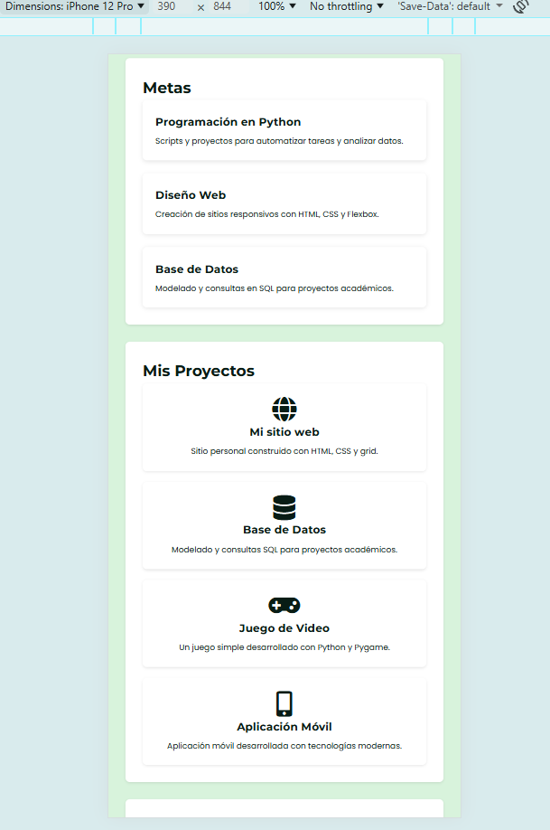
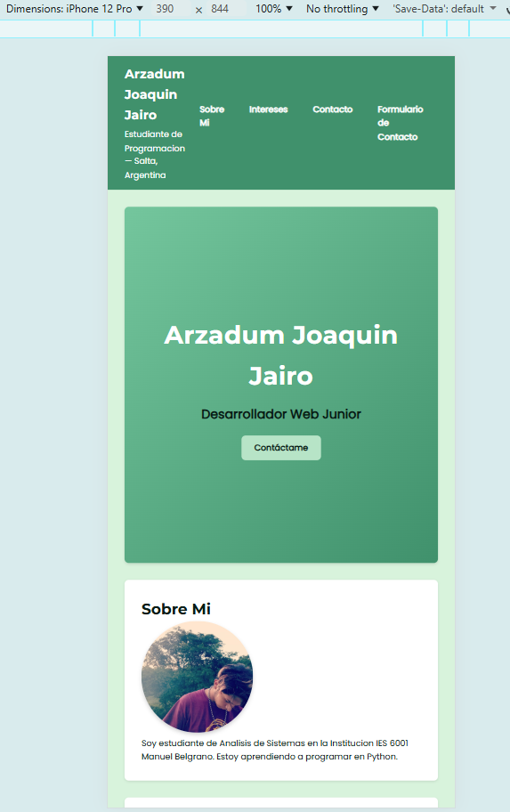
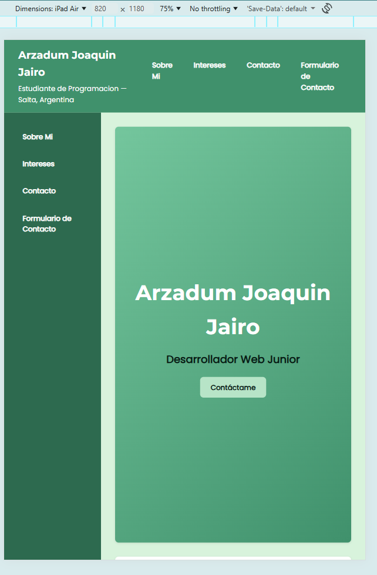
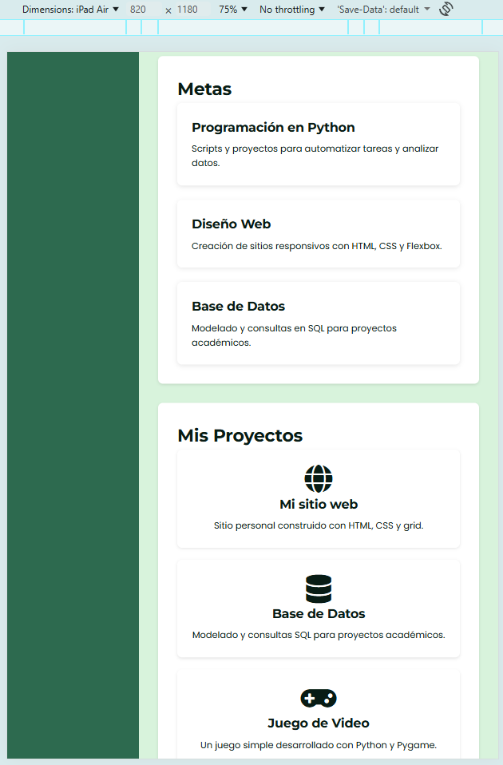
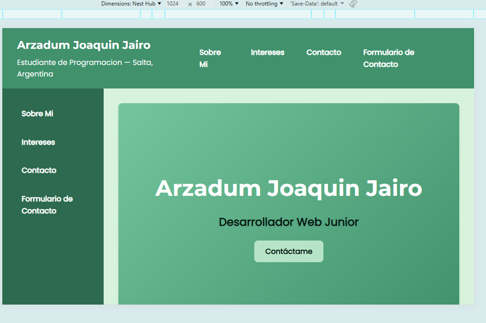
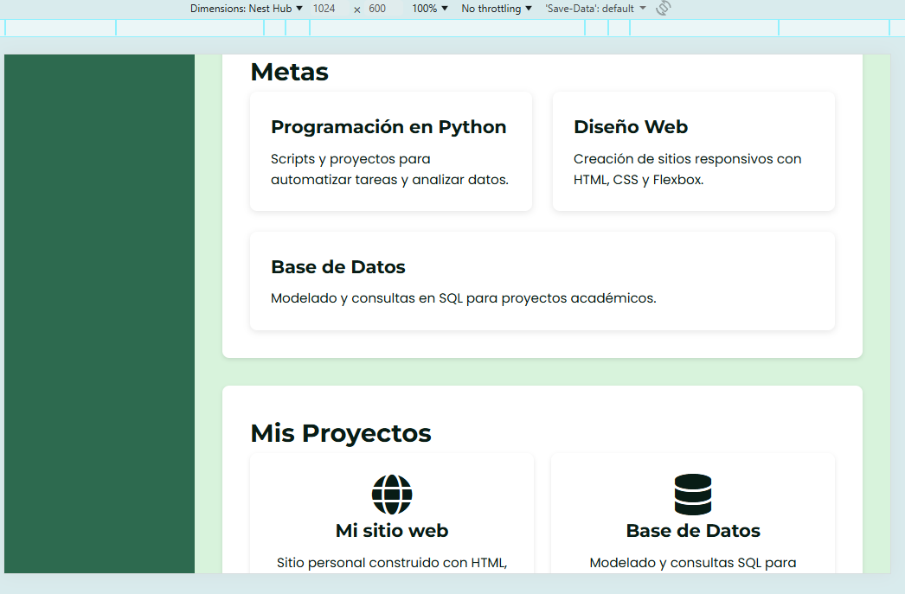

# TP1 - Mi Sitio Web
**Apellido y Nombre:** 
Arzadum, Joaquin Jairo
# Trabajo Practico N1
**Fecha:**
16/03/26
# Descripcion de mi sitio web
En el sitio web creado se encuentra una breve descripcion sobre mi, mis intereses y contacto. Tambien incluye una foto mia. Este proyecto corresponde a la materia Practicas Profesionalizantes II(PP2). Se trata de un sitio web personal desarrollado con HTML5 y CSS3, aplicando Flexbox, Grid y diseño responsive Mobile‑First. El objetivo es mostrar información sobre mí, mis intereses y proyectos, además de practicar buenas prácticas de desarrollo web.

# Link del sitio web en vivo
LINK:  https://joakoarz.github.io/tp1-mi-sitio/

# Tecnologias usadas
1. HTML5: estructura semántica del sitio
2. CSS3: estilos y personalización visual
3. Flexbox: organización flexible de contenedores
4. Grid Layout: distribución de la galería y layout principal
5. Responsive Design: Mobile‑First con media queries
6. Git & GitHub: control de versiones, branches y deploy en 7. GitHub Pages

# Capturas de pantalla 
### Mobile (iPhone 393px)

### Tablet (iPad 820px)

### Desktop (Laptop 1024px)

